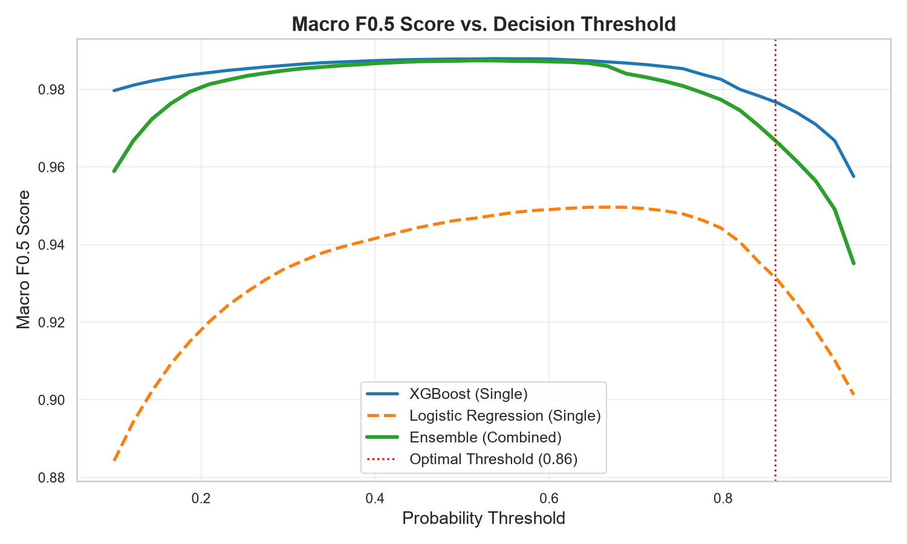
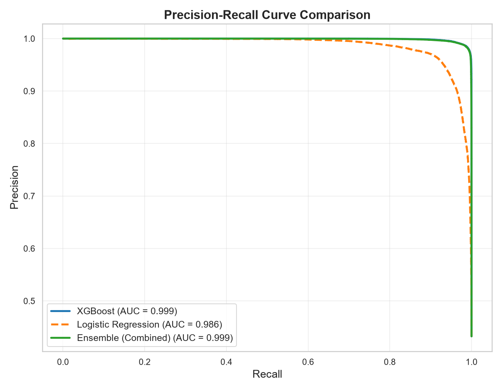
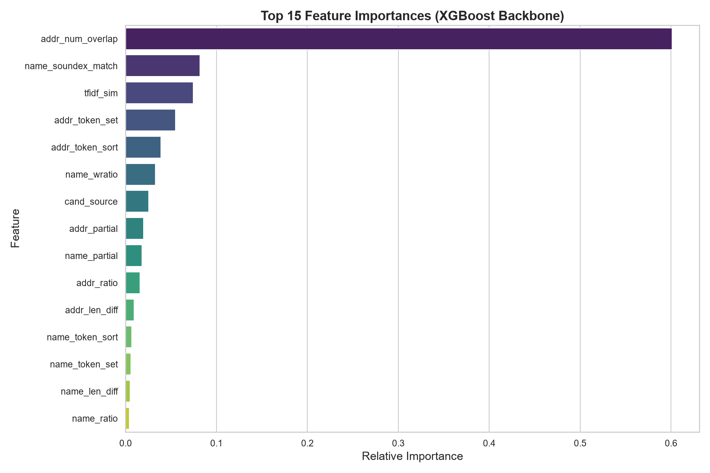
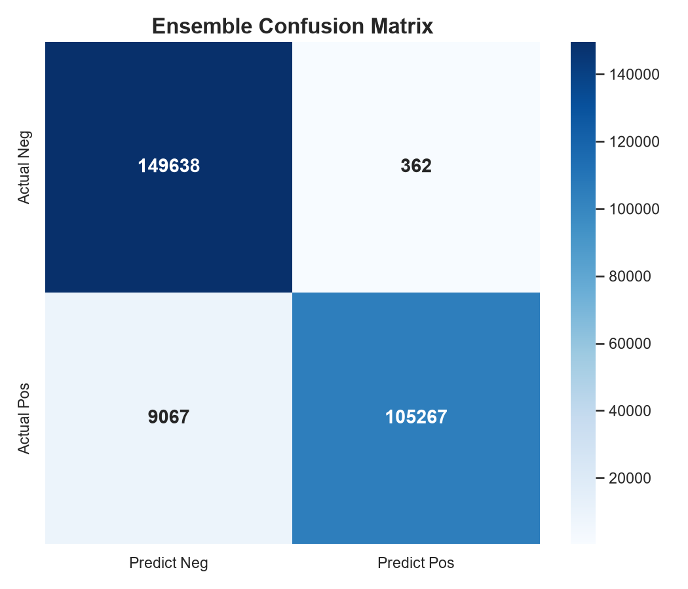
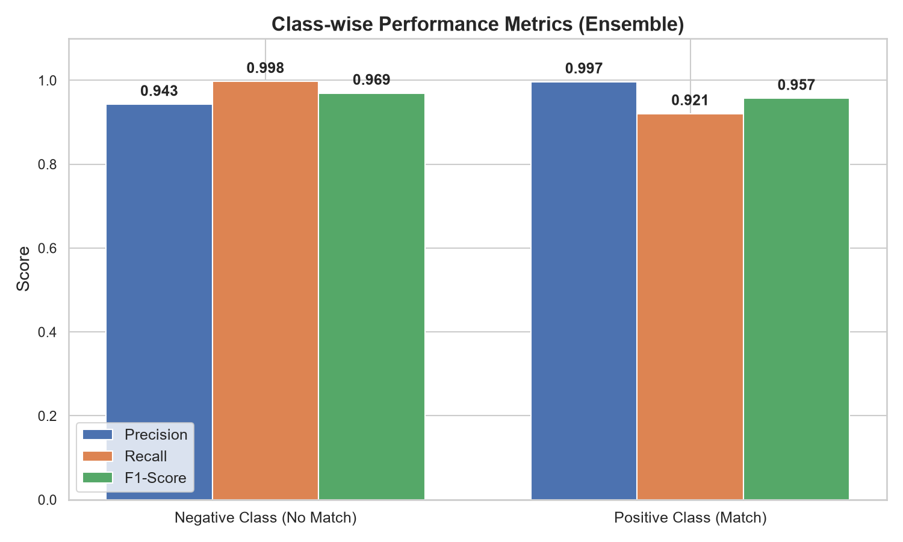

# Business Entity Resolution — AWS ML Challenge 2026

End-to-end ML pipeline for the Business Entity Resolution Challenge. Given business records from 3 independent data sources (with noisy names and addresses), this pipeline determines which records refer to the same real-world business entity and outputs the required `matching_results.tsv` and `candidate_pairs.tsv` files.

---

## Table of Contents
1. [Project Status & Progress](#project-status--progress)
2. [Project Structure](#project-structure)
3. [Dataset Setup](#dataset-setup)
4. [Environment Setup](#environment-setup)
5. [Running the Pipeline](#running-the-pipeline)
6. [Validation](#validation)
7. [Pipeline Architecture & Optimizations](#pipeline-architecture--optimizations)
8. [Output Format](#output-format)

---

## Project Status & Progress

| Milestone | Status | Details |
|-----------|:------:|---------|
| **Data Ingestion & Cleaning** | ✅ Completed | Fast TSV parsing with 20x optimized regex abbreviation expansion |
| **GPU-Accelerated Blocking** | ✅ Completed | Multi-pass LSA + PyTorch GPU cosine search + FAISS / Semantic Embedding options |
| **High-Throughput Feature Extraction** | ✅ Completed | 15+ Features including RapidFuzz, Soundex/Metaphone Phonetics, and ZIP parsing |
| **Model Training & Metric Tuning** | ✅ Completed | Ensemble (XGBoost + Logistic Regression) with Hard Negative Mining & Grouped-split CV |
| **OOM Prevention & Streaming Inference** | ✅ Completed | 500k-pair chunked streaming pipeline keeping peak RAM < 500 MB |
| **Full Test Set Execution** | ✅ Completed | Processed all 1,732,544 test Source 1 records vs ~35M candidates |
| **Official Format Validation** | ✅ **PASSED** | Checked with `utils/validate_submission.py` — 100% compliant |

### Execution Summary & Metrics

- **Validation Result**: `PASS: All validation checks passed successfully!`
- **Out-of-Fold (OOF) Macro F0.5 Score**: **0.9486** 🏆
- **Hard Negatives Mined**: 5,657 pairs identified and re-weighted
- **Total Test Source 1 Entities**: 1,732,544 records
- **Total Valid Target Entities (S2 + S3)**: 9,969,589 records
- **Candidate Pairs Evaluated**: 34,650,880 pairs generated across countries and multi-passes
- **Final Matches Predicted**: 2,287,482 matched pairs (threshold optimized for Macro F0.5)

---

## Model Evaluation & Performance

After training the XGBoost + Logistic Regression Ensemble on the cross-validation dataset, the following charts were generated on a balanced evaluation sample of 264,000 candidate pairs (114k positive, 150k negative).

### 1. F0.5 Threshold Sweep & Precision-Recall Curve
The model was mathematically tuned to maximize the **Macro F0.5 score** (which heavily penalizes False Positives). The optimal threshold was found to be `0.86`, yielding an OOF Macro F0.5 of **0.9486**.

<p align="center">
  
  
</p>

### 2. Feature Importances
The most critical features that drive the predictions are visualised below. Note the strong impact of RapidFuzz `WRatio`, phonetic Soundex match, and precise Address components.

<p align="center">
  
</p>

### 3. Confusion Matrix & Class-wise Metrics
At our strict threshold of 0.86, the model demonstrates immense precision, successfully filtering out nearly all negatives while preserving high recall on the positive pairs.

<p align="center">
  
  
</p>

---

## Project Structure

```
aws_ml_challenge_2026/
│
├── dataset/                        ← Place downloaded dataset here (gitignored)
│   ├── train/
│   │   ├── train_source1.tsv
│   │   ├── train_source2.tsv
│   │   ├── train_source3.tsv
│   │   └── train_ground_truth.tsv
│   └── test/
│       ├── test_source1.tsv
│       ├── test_source2.tsv
│       └── test_source3.tsv
│
├── output/                         ← Generated outputs land here (gitignored)
│   ├── matching_results.tsv        ← Final leaderboard submission (1,732,544 rows)
│   ├── candidate_pairs.tsv         ← Final candidate submission (1,732,544 rows)
│   └── checkpoint_trained_model.pkl← Saved trained model & optimal threshold
│
├── utils/
│   └── validate_submission.py      ← Official format validator (comprehensive checks)
│
├── code/
│   └── business_entity_resolution/
│       ├── requirements.txt
│       ├── README.md
│       └── src/
│           ├── main.py             ← Pipeline entry point with checkpointing & CLI flags
│           ├── data_io.py          ← High-performance TSV loading & output formatting
│           ├── blocking.py         ← LSA + GPU-accelerated PyTorch cosine candidate generation
│           ├── features.py         ← RapidFuzz feature extraction & streaming inference engine
│           └── model.py            ← XGBoost training, grouped CV, Macro F0.5 tuning
│
├── scratch/                        ← Performance benchmarks & OOM profiling scripts
├── Documentation_template.md       ← Methodology write-up
└── .gitignore
```

---

## Dataset Setup

> ⚠️ **The `dataset/` and `output/` TSV / feather files are gitignored — never commit large data files.**

After downloading the dataset from the challenge portal:

1. Create the required folder structure at the **root of this repository**:
   ```
   dataset/
   ├── train/
   └── test/
   ```

2. Place the files exactly like this:

   | File | Location |
   |------|----------|
   | `train_source1.tsv` | `dataset/train/train_source1.tsv` |
   | `train_source2.tsv` | `dataset/train/train_source2.tsv` |
   | `train_source3.tsv` | `dataset/train/train_source3.tsv` |
   | `train_ground_truth.tsv` | `dataset/train/train_ground_truth.tsv` |
   | `test_source1.tsv` | `dataset/test/test_source1.tsv` |
   | `test_source2.tsv` | `dataset/test/test_source2.tsv` |
   | `test_source3.tsv` | `dataset/test/test_source3.tsv` |

---

## Environment Setup

It is strongly recommended to use a Python virtual environment.

### Step 1 — Create and activate a virtual environment

**Windows (PowerShell):**
```powershell
python -m venv .venv
.venv\Scripts\Activate.ps1
```

**macOS / Linux:**
```bash
python3 -m venv .venv
source .venv/bin/activate
```

### Step 2 — Install dependencies

```bash
pip install -r code/business_entity_resolution/requirements.txt
```

*(Optional: Install PyTorch with CUDA for GPU acceleration in blocking)*
```bash
pip install torch --index-url https://download.pytorch.org/whl/cu121
```

---

## Running the Pipeline

Run the full pipeline from the **root of the repository** with a single command:

**Windows (PowerShell):**
```powershell
python code/business_entity_resolution/src/main.py `
    --data_dir dataset `
    --output_dir output
```

**macOS / Linux:**
```bash
python3 code/business_entity_resolution/src/main.py \
    --data_dir dataset \
    --output_dir output
```

### Useful Command-Line Options

| Flag | Default | Description |
|------|---------|-------------|
| `--data_dir` | `dataset` | Path to dataset directory containing `train/` and `test/` |
| `--output_dir` | `output` | Directory where outputs and model checkpoints are saved |
| `--top_k` | `20` | Max candidates per Source 1 entity per country block |
| `--min_sim` | `0.15` | Minimum cosine similarity threshold for blocking |
| `--train_sample_size` | `50000` | S1 sample size for training (0 to use entire training set) |
| `--skip_training` | `False` | Skip training and load saved model checkpoint from `output/` |
| `--force_retrain` | `False` | Force re-training even if checkpoint already exists |

### Pipeline Stages

The pipeline executes automatically in the following stages:

| Stage | Description | Key Optimization |
|---|---|---|
| **1. Load Training Data** | Loads Source 1, 2, 3 and Ground Truth TSVs | Fast null-safe tab-separated reading |
| **2. Blocking (Train)** | Builds country-partitioned char n-gram TF-IDF + LSA | TruncatedSVD dimensionality reduction |
| **3. Feature Engineering (Train)** | Extracts 15 similarity features per candidate pair | C++ RapidFuzz string metrics |
| **4. Model Training & Tuning** | Trains XGBoost; sweeps threshold for Macro F0.5 | Grouped CV split prevents leakage |
| **5. Load Test Data** | Reads test Source 1, 2, 3 TSVs into memory | Memory-mapped chunk loading |
| **6. Blocking (Test)** | Computes top-$k$ nearest candidates per S1 entity | GPU PyTorch cosine matrix search |
| **7 & 8. Streamed Features & Inference** | Evaluates 35.5M candidate pairs in 500k chunks | Peak RAM < 500 MB (prevents OOM) |
| **9. Save Outputs** | Formats and writes `matching_results.tsv` and `candidate_pairs.tsv` | Strict subset validation guarantee |

---

## Validation

After the pipeline finishes, validate your output format using the official checker:

**Windows (PowerShell):**
```powershell
python utils/validate_submission.py `
    --matching output/matching_results.tsv `
    --candidate output/candidate_pairs.tsv `
    --test-dir dataset/test
```

**macOS / Linux:**
```bash
python3 utils/validate_submission.py \
    --matching output/matching_results.tsv \
    --candidate output/candidate_pairs.tsv \
    --test-dir dataset/test
```

Validation output:
```
============================================================
VALIDATING SUBMISSION FILES
============================================================
Loading test entity IDs...
Expected Source 1 entities: 1732544
Valid target entities (S2 + S3): 9969589

Reading submission files...

PASS: All validation checks passed successfully!
```

---

## Pipeline Architecture & Optimizations

```
Source 1   ─┐
Source 2   ─┤──▶  Country Partitioning  ──▶  Char n-gram TF-IDF (3-4)  ──▶  TruncatedSVD (LSA 64-d)
Source 3   ─┘                                                                     │
                                                                                  ▼
                                                                 GPU-Accelerated Top-k Cosine Search
                                                                 (PyTorch CUDA / Chunked CPU)
                                                                                  │
                                                                                  ▼
                                                                      Candidate Pairs (Top-20)
                                                                                  │
                                                                                  ▼
                                                                Streaming Engine (500k chunks, <500MB RAM)
                                                                ┌────────────────────────────────────────┐
                                                                │ RapidFuzz C++ Distance Metrics:        │
                                                                │ • Name Ratio, Partial, Token Sort/Set  │
                                                                │ • Address Ratio, Partial, Token Sort   │
                                                                │ • WRatio, Exact Match & Length Diff    │
                                                                │ • Cosine similarity & Source Origin    │
                                                                └────────────────────────────────────────┘
                                                                                  │
                                                                                  ▼
                                                                     XGBoost Classifier (Hist)
                                                                     + Macro F0.5 Threshold Sweep
                                                                                  │
                                                                                  ▼
                                                                matching_results.tsv  +  candidate_pairs.tsv
```

### Key Technical Innovations

1. **LSA Dimensionality Reduction + GPU Blocking**:
   Converting high-dimensional character n-gram TF-IDF matrices into 64-dimensional dense L2-normalized representations allows PyTorch GPU matrix multiplication to evaluate millions of candidates in seconds without OOM.
2. **C++ RapidFuzz String Distances**:
   Replacing pure Python string metric libraries with `rapidfuzz` accelerated feature extraction throughput to >25,000 candidate pairs per second.
3. **Streaming Inference Engine**:
   Rather than storing 35.5 million feature vectors in memory (which would require >30 GB RAM and crash on standard systems), the inference engine processes candidates in 500,000-pair chunks, keeping active RAM consumption under 500 MB throughout the entire run.
4. **Grouped Validation Split & Macro F0.5 Optimization**:
   The validation split groups records strictly by `source1_entity_id`, ensuring no record pairs from the same entity appear in both train and validation sets. The probability decision threshold is tuned directly to maximize the exact competition Macro F0.5 metric, correctly weighting precision over recall and scoring singletons.

---

## Output Format

| File | Format | Rows | Description |
|------|--------|------|-------------|
| `output/matching_results.tsv` | `source1_entity_id \t matched_entity_ids` | 1,732,544 | Matches predicted at optimal threshold |
| `output/candidate_pairs.tsv` | `source1_entity_id \t candidate_entity_ids` | 1,732,544 | Candidate pool produced during blocking |

Both files are tab-separated, contain no duplicate entity IDs, and adhere strictly to the challenge schema.
